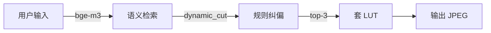

# ProjectLUT

> 一句话描述调色风格 → 语义匹配 → 自动套 LUT 到图片



## 快速开始

```bash
pip install -e .
python serve.py                    # 启动 Web GUI → http://localhost:8765
```

浏览器打开后：上传图片 → 搜索风格 → 选择 LUT → 应用调色。

CLI：
```bash
lut index                          # 首次建索引
lut search "冷色调胶片感"           # 语义检索
lut apply "冷色调胶片感" a.jpg -o b.jpg  # 套 LUT
lut stats                          # 搜索统计
```

## 技术栈

| 层 | 选型 |
|----|------|
| 嵌入模型 | Ollama bge-m3 (1024-dim) |
| 检索 | numpy 余弦相似度 |
| 3D LUT 渲染 | numpy + Pillow（纯实现，无 colour-science） |
| 规则纠偏 | 关键词意图检测，6 方向（对比度/饱和度/色温） |
| 日志 | JSON 文件存储，query_vector 持久化 |
| 搜索分析 | 前端统计面板（总搜索/平均耗时/热门查询） |
| GUI | HTML + Python HTTPServer（ThreadingHTTPServer） |

## 项目结构

```
├── serve.py              # HTTP API 服务（端口 8765）
├── app.html              # 浏览器 GUI
├── src/lut/
│   ├── parser.py         # .cube 解析 → Preset 模型（含元数据）
│   ├── direct_embed.py   # bge-m3 嵌入 + 余弦检索 + 搜索日志
│   ├── processor.py      # 3D LUT 渲染管线（sRGB/Log 双管线）
│   ├── rerank.py         # 规则层语义纠偏
│   └── cli.py            # 命令行入口
├── data/search_log/      # JSON 搜索日志
├── LUT预设1/              # 152 个 .cube LUT 文件
├── scripts/
│   ├── active/           # 运维入口（启动/检查/端到端测试）
│   └── archive/          # 历史脚本归档
└── docs/
    ├── architecture.md   # 架构设计
    ├── color-pipeline.md # 色彩管线设计
    └── search-analytics-design.md
```

## 搜索流程

```
用户输入 → embed_query(bge-m3) → 余弦 vs vectors.npy(152)
  → dynamic_cut（0.3 底线 + 0.15 陡降 + 6 上限）
  → rule_filter（6 意图方向：低/高对比度、低/高饱和度、暖/冷色）
  → log_search_json（持久化 + 点击回传）
  → 前端展示结果列表 + 缩略图预览
  → 用户选择 + apply_lut → JPEG 输出
```

## 已知限制

- **Log 曲线精度**：Cineon 通用近似，特定摄影机 Log（Arri/S-Log/C-Log）不匹配
- **黑白 LUT**：库中无真正黑白/去色预设
- **否定修饰**：bge-m3 不理解「低一点」「不要太」等语义反转，依赖 rule_filter 关键词弥补

## 文档

- [架构设计](docs/architecture.md)
- [色彩管线设计](docs/color-pipeline.md)
- [搜索统计分析](docs/search-analytics-design.md)
