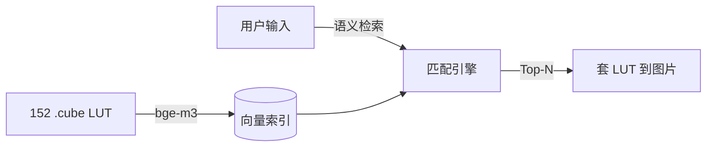

# ProjectLUT

> 一句话描述调色风格 → 语义匹配 → 自动套 LUT 到图片



## 快速开始

```bash
pip install -e .
lut index              # 构建向量索引（首次）
lut search "冷色调胶片感"           # 语义检索
lut apply "冷色调胶片感" photo.jpg -o result.jpg  # 套 LUT
```

## 使用方式

| 方式 | 命令 |
|------|------|
| CLI | `lut search / apply / list / stats / history` |
| GUI | `python serve.py` → 浏览器打开 `app.html` |
| Python | `from lut.parser import load_presets` |

## 项目结构

```
src/lut/
├── parser.py         # .cube 解析（路径元数据 + RGB 色彩数据）
├── direct_embed.py   # bge-m3 直接向量化（主路径）
├── embedder.py       # LightRAG 备用（论文 RAG 阶段）
├── matcher.py        # LightRAG 查询接口（备用）
├── processor.py      # 3D LUT 应用 + log→709 转换
└── cli.py            # 命令行入口
```

## 技术栈

| 层 | 选型 |
|----|------|
| 嵌入 | Ollama bge-m3 (1024-dim) |
| 检索 | numpy 余弦相似度 |
| LUT 处理 | colour-science |
| LLM (备用) | Ollama qwen3:8b + LightRAG |
| GUI | HTML + Python HTTP Server |

## 文档

- [架构设计](docs/architecture.md)
- [LightRAG 功能模块](docs/reference/lightrag-modules.md)
- [LUT 行业工作流](docs/reference/lut-workflow-research.md)
- [搜索统计分析](docs/search-analytics-design.md)
- [飞书多维表格](https://my.feishu.cn/base/Qm6wbwwYnac3Djs86E1csNiYnqf?table=tblLegX3JjXMF4qt)
