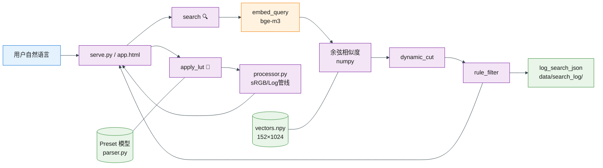

## 模块说明

| 模块 | 文件 | 职责 |
|------|------|------|
| **HTTP 服务** | `serve.py` | ThreadingHTTPServer，路由 /api/search|apply|click|preview|stats|ping |
| **语义检索** | `direct_embed.py` | bge-m3 嵌入 + numpy 余弦相似度，返回 `(preset_id, score, index)` |
| **动态截断** | `direct_embed.py:dynamic_cut()` | 0.3 底线 + 0.15 陡降 + 6 上限 |
| **规则纠偏** | `rerank.py:rule_filter()` | 关键词检测 6 意图，排除 contrast/saturation/tone 不匹配结果 |
| **日志** | `direct_embed.py` | JSON 文件存储，query_vector 持久化 + clicked_preset_id 回传 |
| **调色** | `processor.py` | sRGB 直查 / Log 管线（Cineon）+ 高光衰减 |
| **解析** | `parser.py` | .cube → Preset 模型，含 contrast/saturation/tone 元数据 |
| **前端** | `app.html` | 上传/搜索/预览网格/统计面板 |
| **AI 推理** | Ollama bge-m3:latest | 1024-dim 嵌入，单次搜索 ~4.5s |

## 数据流

```
query → embed_query(bge-m3) → 余弦 vs vectors.npy(152)
  → dynamic_cut(6) → rule_filter(6意图) → log_search_json
  → frontend renders results + preview grid
  → user selects + apply_lut(srgb|log_cinema) → JPEG output
```

## 核心路径（不可移动）

```
serve.py → src/lut/{direct_embed,parser,processor,rerank,cli}.py
         → app.html → LUT预设1/ → data/search_log/
```
