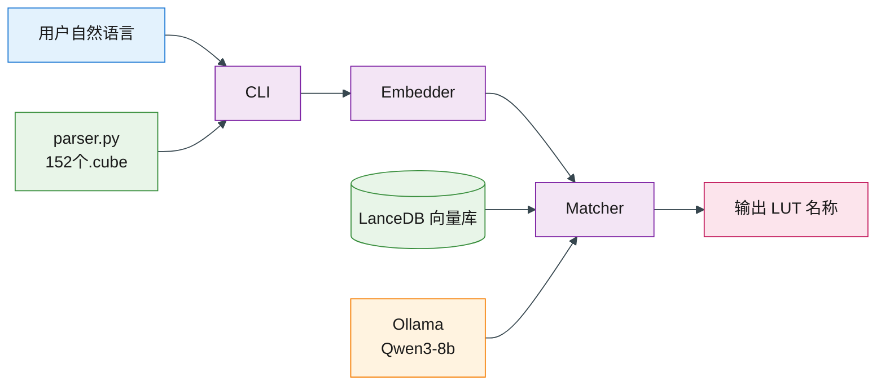

## 模块说明

| 节点 | 类型 | 职责 |
|------|------|------|
| **用户自然语言** | 入口 | 用户用日常语言描述想要的调色效果，如"我想要冷色调胶片感"或"明亮温暖秋天氛围" |
| **CLI** | 流程 | 命令行入口，接收用户输入，调度下游模块，最终输出匹配结果 |
| **Embedder** | 流程 | 调用 Ollama bge-m3 模型，将用户输入和 LUT 预设名称分别向量化，统一语义空间 |
| **Matcher** | 流程 | 计算用户输入向量与 152 个 LUT 向量的余弦相似度，排序返回 Top-N 匹配结果 |
| **输出 LUT 名称** | 输出 | 展示匹配到的 LUT 预设名称列表，按相似度降序 |
| **parser.py** | 数据 | 解析 `LUT预设1/` 下全部 .cube 文件，提取预设名称、色彩空间（log/709）、作者等元数据 |
| **LanceDB 向量库** | 存储 | 嵌入式向量数据库，存储 152 个预设名称的向量，支持快速相似度检索，零配置 |
| **Ollama** | 模型 | 本地推理服务：bge-m3 负责嵌入向量化，qwen3:8b 预留在 Matcher 需要语义理解时介入 |
