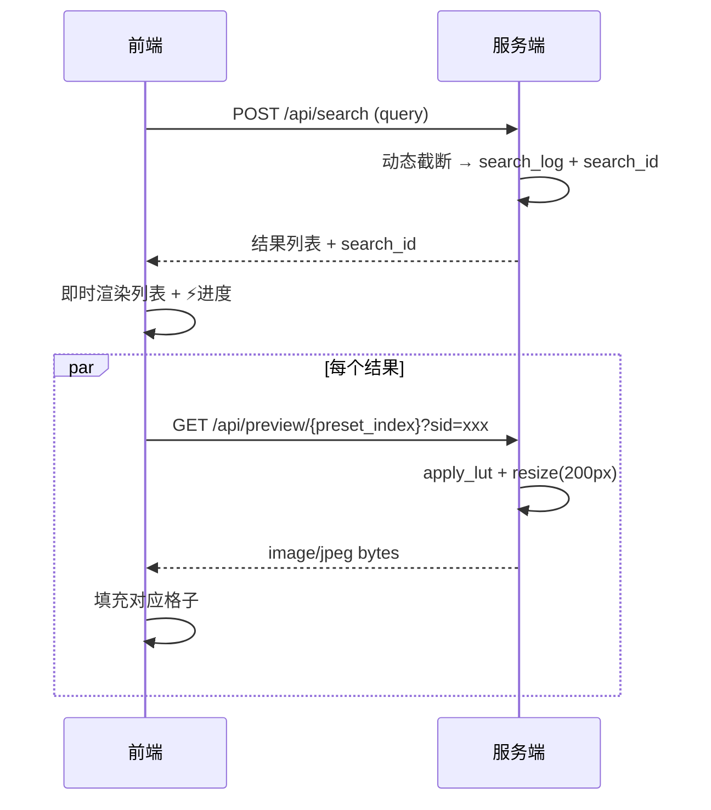

# 搜索分析 v2 — 设计文档

## 概述

将搜索日志从临时 SQLite 固化为 JSON 文件结构，支持 query 向量持久化、点击行为回溯、动态结果截断。

## 数据层

### 文件结构

```
data/search_log/
├── 2026-06-21_001.json
├── 2026-06-21_002.json
├── ...
```

### 单条记录格式

```json
{
  "id": "2026-06-21_001",
  "query": "冷淡",
  "query_vector": [0.023, -0.451, 0.897, "…(1024 floats)"],
  "top_count": 6,
  "top_results": [
    {"name": "人像冷白", "score": 0.570, "index": 79},
    {"name": "cold冷白", "score": 0.530, "index": 58}
  ],
  "clicked_index": null,
  "duration_ms": 3,
  "timestamp": "2026-06-21T14:30:00.000"
}
```

| 字段 | 类型 | 说明 |
|------|------|------|
| `id` | string | `YYYY-MM-DD_NNN`，日增序列 |
| `query_vector` | float[1024] | bge-m3 嵌入，用于未来近义词聚合 |
| `top_results[].index` | int | vectors.npy 中的位置 (0-151)，改名不变追溯 |
| `clicked_index` | int/null | vectors.npy 中的 index，前端回传后补写 |

### 旧数据迁移

旧的 `.lut_vectors/search.db` 不删除，新日志写 JSON 路径。两套并行。

## 搜索核心

### 动态截断算法

```python
def dynamic_cut(results: list[(str, float)], min_score=0.3, max_count=10, drop_threshold=0.15):
    """
    results: 按 score 降序排列的 [(text, score), ...]
    返回截断后的列表。

    策略：
    1. 每个结果 score >= min_score（绝对底线）
    2. 从第 2 个开始，若 score[i-1] - score[i] > drop_threshold，截断
    3. 最多 max_count 个
    """
```

举例：
- `[0.62, 0.55, 0.48, 0.42, 0.35, 0.31, 0.18, 0.12]` → 返回 6 个（0.18 < 0.3 排除）
- `[0.62, 0.55, 0.25, 0.12]` → 返回 2 个（0.55→0.25 陡降）

### search() 返回

```python
{
    "results": [{"name": "...", "score": 0.xxx, "index": 79}, ...],
    "count": 6,
    "ms": 3,
    "search_id": "2026-06-21_001"   # 前端 apply 时回传
}
```

### log_search() 重构

`direct_embed.py` 中 `log_search()` 从 SQLite 改为写 JSON 文件。
`log_click(search_id, preset_index)` 新增：回读 JSON 文件补写 `clicked_index`。

## 前端

### 状态条改动

```
原：    ✓ 5 个匹配（本地 7048 ms）
改为：  ⚡ 3ms · 共 6 个匹配
```

`statusEl.textContent` 从服务端返回的 `ms` 和 `count` 字段渲染。

### 结果列表

动态渲染，不做固定 5 个。服务端返回几个就展示几个。
每项包含：排名、预设名、分数。

### 点击回传

- 搜索返回携带 `search_id`
- 用户点击某个 LUT 应用时，前端 `POST /api/click` 携带 `search_id` + `preset_index`
- 服务端调用 `log_click()` 补写 JSON

## API 变更

### POST /api/search → 返回新增字段

```json
{
    "results": [{"name": "...", "score": 0.xxx, "index": 79}, ...],
    "count": 6,
    "ms": 3,
    "search_id": "2026-06-21_001"
}
```

### POST /api/click（新增）

请求：
```json
{"search_id": "2026-06-21_001", "preset_index": 79}
```

响应：
```json
{"ok": true}
```

## 百图预览（本期实现）

流式渲染：搜索结果返回后，前端立即显示结果列表，然后逐个拉取缩略图填充。

### 数据流



前端最多并行 3 个请求（控制服务端负载），逐格填充。

### API

#### GET /api/preview/{preset_index}?sid={search_id}

服务端用最近的搜索图（上传的图片）对该 preset 快速套 LUT → resize 到 200px 短边 → 返回 JPEG。

如果尚未上传图片，返回 400。

### 前端

搜索结果列表下方展示预览网格（最长边 200px，横向滚动）。每个格子：
- 默认灰色占位
- 请求完成后填入缩略图
- 点击格子 = 选中预设（与列表点击等价）

## 视频方向（规划阶段）

```
输入视频 → OpenCV 逐帧读取 → 每帧套 LUT → 编码输出
```

待定：GPU 加速需求、实时预览 vs 离线渲染。

## 不动

- `vectors.npy` / `texts.txt`：schema 不变
- `processor.py` 管线逻辑
- `parser.py` 解析逻辑
- `cli.py`（可后续补 `lut log` 命令）

## 测试

- `test_direct_embed.py`：新增 `test_log_to_json()`、`test_dynamic_cut()`、`test_log_click()`
- 动态截断的边界：空列表、全低分、陡降、0.3 临界
